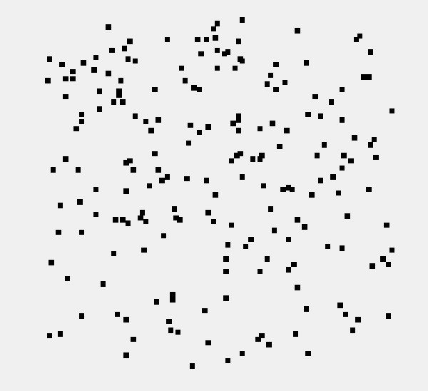

# K-d-Trees in Nearest Neighbour Searches

Let us be given points in d-dimensional Euclidean space. A K-d-tree is a binary tree where the underlying space is partitioned on the basis of the value of just one attribute (dimension) at each level of the tree, thereby making d tests at each level. For instance, we pick a dimension i < d and also a value p, such that all the points whose i-th coordinate value is less than p is assigned to the left subtree at this level and other points are assigned to the right subtree. 

This data structure is very useful while searching range queries, i.e., all those points that are within a certain distance of a given query point q

Let us for the moment assume that d = 3 and q = (a,b,c). If we want to find all the data points that are less than distance ‘r’, it is sufficient to search the subtrees that have values in the range (r-a, r+a) for a particular dimension i, and similarly for the other attributes/ dimensions. Thus searching for neighbours within a range amounts to traversing through this data structure wisely}

 
# The visualisation of example data taken

This repo contains the C++ Implementation of KD Tree, scalable algorithm for nearest neighbour search in a high dimensional data space done as a group project by Deepak, Manoj and Prajwal for the course Data Structures and Application Lab, MA2233 instructed by Dr. Balasubramaniam Jayaram at Indian Institute of Technology, Hyderabad.

